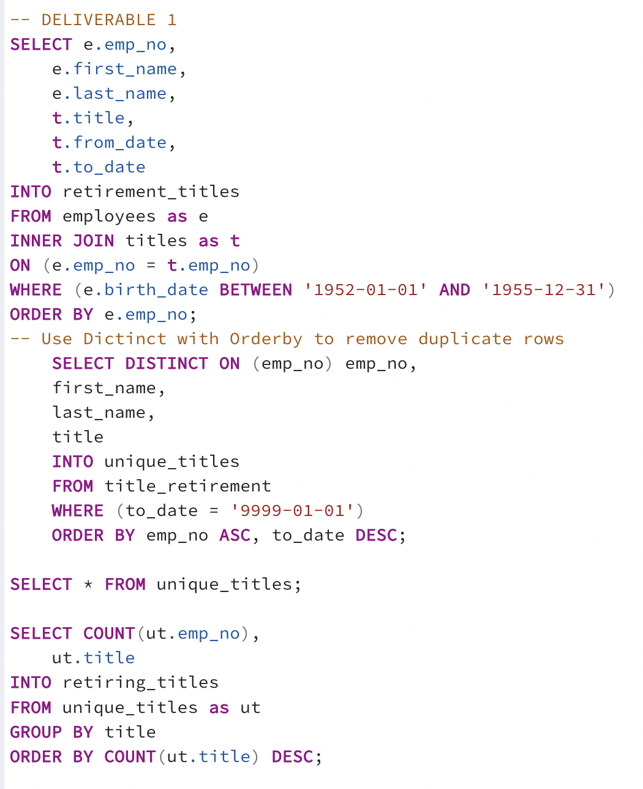
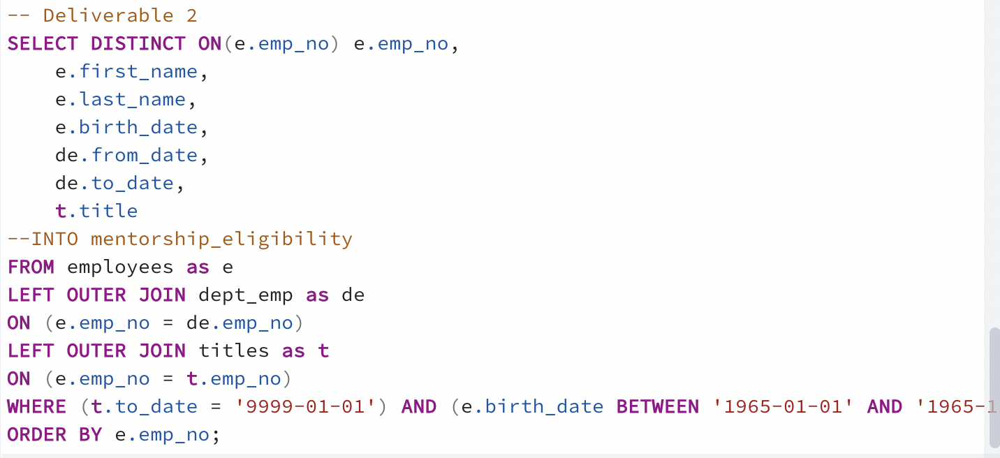
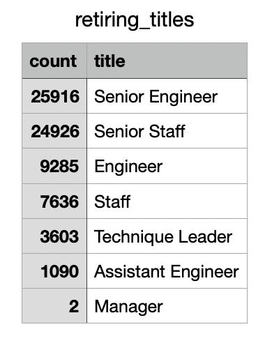
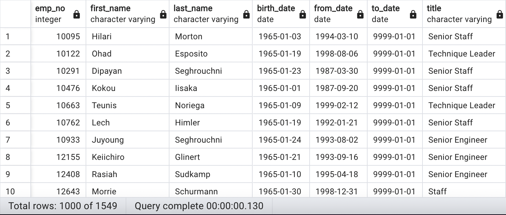

# Pewlett-Hackard-Analysis 

## Overview and Purpose
This project tested our SQL skills, specifically with PostgreSQL. In this project, a number of CSV files containing employment information about the Pewlett Hackard employees/titles/ages/etc. were given to us in order to organize the data and complete the following tasks:
    1. Determine the number of retiring employees per title.
    2. Identify any employees that are eligible for participation in the mentorship program.  
As many of the employees are reaching the age for retirement eligibility, this report will help identify the future staffing needs of the company and could also help with building a wider mentorship base within the company.  

## Results
The following images show the queries that were completed for the two deliverables of this project. 

  * There will be over 70,000 jobs to fill in the near future, as there are a LOT of staff members that are eligible for retirement (or just nearing it). 

  * Roughly 70% of all retiring employees have a title of Senior Engineer or Senior Staff.  This is going to be a major transition for both title categories of employment, and I would recommend honing in on hiring for these positions early and also targeting these people to be mentors. 
    

  * As over 50,000 Senior engineers/staff are retiring soon, there will need to be thoughts about the financial resources to promote other to those "Senior" level roles, along with hiring new employees at competitive wages. Finance should be made aware of this data so that they can also start planning for the silver tsunami as well.  

  * There are 1549 employees eligible to becomes mentors. Even if every single eligible employee agrees to become a mentor (which could be unlikely), there is a lot of open positions to fill and mentor for, which could burn these 1549 people out and cause them to retire even quicker without assisting in the transition phase.  

## Summary 

How many roles will need to be filled as the "silver tsunami" begins to make an impact?
- With the sum of the number of employees based on their retiring title, there will be over 70,000 jobs to fill. This shows the importance of getting a solid mentorship program put in place, as there will be a lot of new hires in the near future.  

Are there enough qualified, retirement-ready employees in the departments to mentor the next generation of Pewlett Hackard employees?
- According to the image below that shows all the eligible mentors, there are only 1549 employees that fit the prerequisites.  1549 is simply not enough to mentor/train 70,000 employees, as they would each have to mentor 45 employees! That seems like it would be rather ineffective, as their attention will be very split from having so many mentees.  

